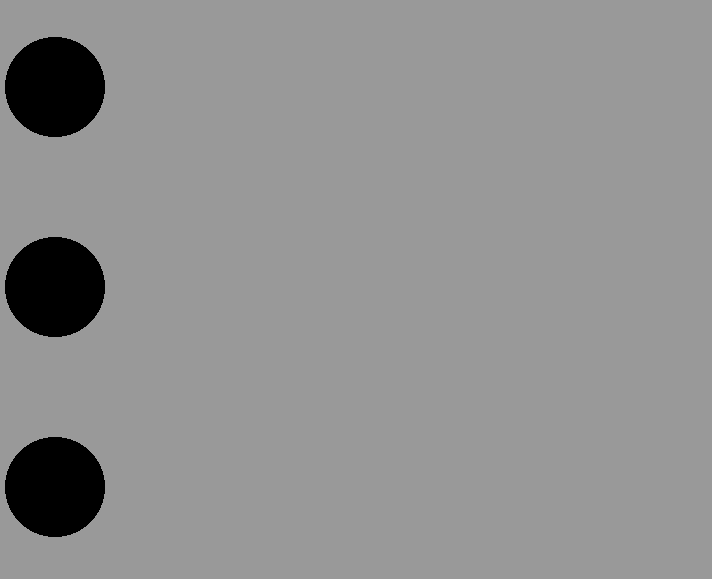
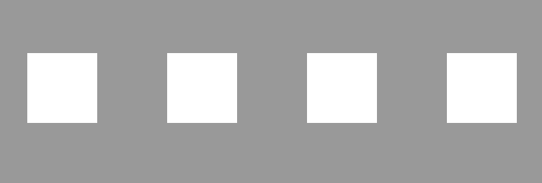
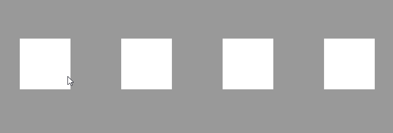
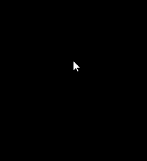

# GSAP Exercise


## Setup
1. Setup application
- Download project files and setup libraries
- Start the application using the `npm start` commad in the terminal
- Navigate to the index page in a web browser. Note there are multiple HTML files and entry points for each task

## Basic Animations

1. Setup application
- Open the `circle.ts` file
- Import the Pixi library and create an application with 800x600 resolution, using color **0x999999** for the background. Add the application's view to the page
- Import the GSAP library and Pixi plugin. Regsiter the Pixi plugin with the GSAP instance and register the Pixi library with the plugin instance

2. Animate circle
- Create a Pixi **Graphics** object and draw a **black** circle with radius 50. Position the center of the circle at coordinates **100,100**
- Animate the movement of the circle
  - Target position for the center of the circle is **700,100**
  - Use the Pixi plugin notation to animate the x-position of the circle to 700 units
  - Set a duration of 2 seconds and delay of 1 second
- Scale up the circle
  - Target scale is **1.5**
  - Set the duration to 1 second and the delay to 1 second
- Scale down the circle
  - Target scale is **1**
  - Set the duration to 1 second and the delay to 2 second

3. Animation easing
- Create two more circles with the same animations as the one in Section 2
  - Position the second circle at **100,300** and animate it's movement to **700,300**
  - Position the third circle at **100,500** and animate it's movement to **700,500**
- Configure easing for the second circle:
  - The movement uses a **linear ease**
  - Both scaling animations use an **elastic ease**
    - The scale up animation uses an ease-out
    - The scale down uses an ease-in
- Configure easing for the third circle:
  - The movement uses a **sine ease** on both ends (in and out)
  - Both scaling animations use a **bounce ease**
    - The scale up animation uses an ease-out
    - The scale down uses an ease-in

**Example:**



## Animating Properties

1. Setup application
- Open the `boxes.ts` file
- Import the Pixi library and create an application with 800x600 resolution, using color **0x999999** for the background. Add the application's view to the page
- Import the GSAP library and Pixi plugin. Regsiter the Pixi plugin with the GSAP instance and register the Pixi library with the plugin instance

2. Create boxes
- Create 4 white squares with size **100x100** and position them centered at coordinates:
  - **100,300**
  - **300,300**
  - **500,300**
  - **700,300**

3. Configure animations
- Apply the following animations to each of the 4 squares:
  - `rotation: 360`
  - `blur: 10`
  - `skewX: 50`
  - `tint: 0xff0000`
- Make all animations last for 2 seconds and start with a delay of 1 second

**Example:**



## Interactivity

1. Adjust animations
- Remove the delay from all animations
- Make all animations start with `paused: true`
- Set the duration to 1 second

2. Setup interactivity
- Make each of the boxes interactable
- Add a `pointertap` event listener
- Have the event listener for each of the boxes start it's animation

3. Auto-reverse animations
- When the user clicks, track the direction of the animation for each box:
  - If the animation is reversed, play it forward
  - Otherwise, reverse it

**Example:**



## Fireworks

1. Setup application
- Open the `fireworks.ts` file
- Import the Pixi library and create an application with 800x600 resolution, using color **0x000000** for the background. Add the application's view to the page
- Import the GSAP library and Pixi plugin. Regsiter the Pixi plugin with the GSAP instance and register the Pixi library with the plugin instance

2. Create particle spawner
- Create a function `particle` which takes two parameters:
  - `color: number`
  - `parent: PIXI.Container`
- Upon execution, the function creates a **Graphics** object
  - Draw a **white** square `4x4` pixels and center its pivot
  - Apply the following animations:
    - **From:** `scale: 0` **To:** `x: 'random(-100, 100)'`, `y: 'random(-100, 100)'`, `rotation: 1440`, `scale: 2`, `blur: 1` **Duration:** 2 seconds
    - **To:** `tint: color parameter` **Duration:** 1 second
    - **To:** `tint: 0` **Duration:** 1 second **Delay:** 1 second
  - Add the created particle to the `parent` parameter
- Test the function with a placeholder container

3. Create fireworks spawner
- Create a function `firework` which takes three parameters:
  - `x: number`
  - `y: number`
  - `color: number`
- Upon execution, the function creates a **Container**
  - Set its position to the passed in `x` and `y` parameters
  - Create 100 particles using the passed in `color` parameters and add them to the container
  - Configure an animtaion to move the container down 100 pixels from its starting position
    - Set duration 2 seconds
    - Use the **power2** ease-in
  - Add an `onComplete` callback to the animation which **destroys** the container (`container.destroy()`)
  - Return the created container
- Test the function by calling it with placeholder coordinates and adding it to the stage

4. Setup interactivity
- Create a **Graphics** object
- Fill it with a black rectangle the size of the canvas
- Add the object to the stage
- Set it up as interactive and add a `pointertap` event listener
  - Take the `globalX` and `globalY` event coordinates and use them to spawn a firework
  - Use a random color. The following bitwise expression can be used:

```javascript
((Math.random() * 256 | 0) << 16) + ((Math.random() * 256 | 0) << 8) + (Math.random() * 256 | 0)
```

- Test the fireworks!

**Example:**



## Spinning Gears

1. Setup application
- Open the `gears.ts` file
- Import the Pixi library and create an application with 800x600 resolution, using color **0x999999** for the background. Add the application's view to the page
- Import the GSAP library and Pixi plugin. Regsiter the Pixi plugin with the GSAP instance and register the Pixi library with the plugin instance

2. Load assets
- By using **PIXI.Assets**, load all gear images from the `assets` folder

3. Create gear spawning function
- Create a function `spawnGear` which creates a new sprite
- The number and type of parameters is up to you
- Upon execution, the function:
  - Creates a new sprite, using one of the previously loaded gear textures
  - Sets the sprite's anchor such that chaning the rotation of the object appears to rotate the gear about its axis
  - Sets the position of the sprite such that the axis of the gear is centered on given coordinates
  - Applies a looping animation to the gear with linear easing and given duration

4. Create and position animated gears
- Using the `gear40.png` texture:
  - Centered at **400,300**
  - Rotating 360 degrees **clockwise**
  - Animation duration **20 seconds**
- Using the `gear12.png` texture:
  - Centered at **300,117**
  - Rotating 360 degrees **counter-clockwise**
  - Animation duration **6 seconds**
- Using the `gear28.png` texture:
  - Centered at **142,130**
  - Rotating 360 degrees **clockwise**
  - Animation duration **14 seconds**
- Using the `gear16.png` texture:
  - Centered at **542,471**
  - Rotating 360 degrees **counter-clockwise**
  - Animation duration **8 seconds**
- Using the `gear24.png` texture:
  - Centered at **676,388**
  - Rotating 360 degrees **clockwise**
  - Animation duration **12 seconds**
- Using the `gear20.png` texture:
  - Centered at **212,441**
  - Rotating 360 degrees **counter-clockwise**
  - Animation duration **10 seconds**

5. Add speed controls
- Modify the gear spawning function such that the created animation is exposed (returned or added to some globally-accessible scope)
- Create four speed controlling functions and make then modify the `timeScale` property of each gear animation:
  - `pause` - pauses the animation
  - `normal` - plays the animation at 1x speed
  - `fast` - plays the animation at 2x speed
  - `faster` - plays the animation at 4x speed
- **Tip:** to test the functions, add them to the `window` global object

6. Add interactivity
- Load the `gearbox.png` asset and render a sprite with this texture centered on the largest gear
- Load the `speed-paused.png`, `speed-normal.png`, `speed-fast.png` and `speed-faster.png` assets
- Render a sprite for each of the 4 textures over the `gearbox` sprite
- Make the four buttons interactive and add a `pointertap` event listener, which executes the corresponing speed controlling function from Section 2.

**Example:**


## **(BONUS)** Clock

Using the gears from the **Spinning Gears** task, arrange them in such a way as to create a clock with three indicators: 1 second, 60 seconds and 60 minutes.

- Use a **Graphics** object to draw a clock hand for each of the indicators. It can be a seperate object, or part of a gear sprite (remember, sprites are just containers and can have children)
- You need to achieve the following speeds:
  - For the second hand, 1 revolution per second (60 rpm)
  - For the seconds hand, 1 revolution per minute (1 rpm)
  - For the minutes hand, 1 revolution per hour (1/60 rpm)
- **HINT:** The following gear rations might be helpful:

  - 12/16 = 3/4
  - 12/20 = 3/5
  - 12/24 = 1/2
  - 12/28 = 3/7
  - 12/40 = 3/10

  - 16/20 = 4/5
  - 16/24 = 2/3
  - 16/28 = 4/7
  - 16/40 = 2/5

  - 20/24 = 5/6
  - 20/28 = 5/7
  - 20/40 = 1/2

  - 24/28 = 6/7
  - 24/40 = 3/5

  - 28/40 = 7/10

- **TIP:** Make the canvas bigger, or scale down the gear assets